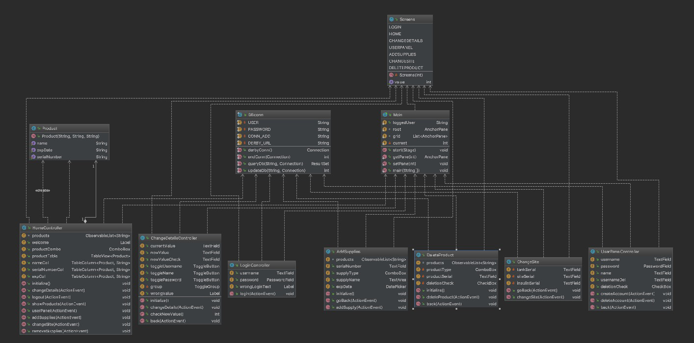
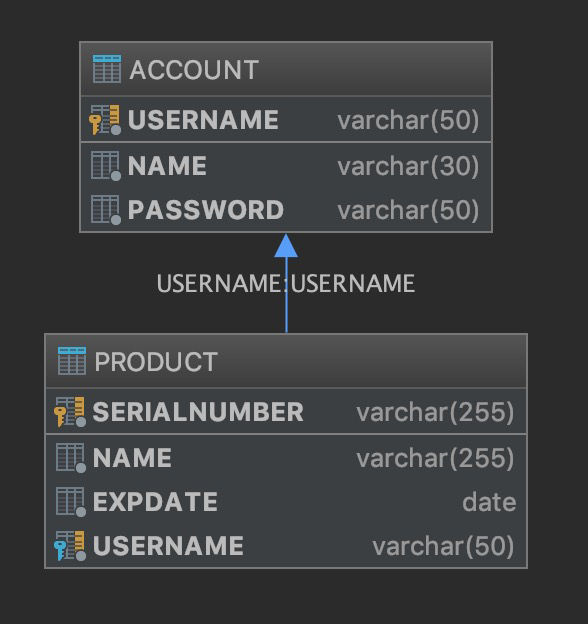

# Diabetes Supplies Project

**This is the myDiabetesSupplies project with embedded Derby DB integration instead of MySQL**.

This project was in the back of my mind for a long time. It was previously developed in C, but did not have a GUI or database.
It was very rudimental. I wanted to take a step ahead and improve it (as well as my knowledge with Java, JavaFX, and Apache Derby DB). It is a very dear project to me, as I've been diagnosed with type 1 Diabetes since February 2004. I love to apply the skills that I possess to solve real life problems.

This project was incentivated by Professor Vanselow, and his COP 3003 class. 
The files contained in this repository are used for grading purposes in the COP 3003 class of the fall semester 2018.

The languages used are **Java**, **JavaFX**, and **SQL**.
This project is going to be under constant development. Whenever something will need to be added to the program, it will also  be displayed under the **ToDo** section of this README.

## Project Description

This project is aimed towards creating a software to manage diabetes supplies. There can be multiple users added. These users will be stored in a database along with a table reserved for the supplies. The primary key of the user is going to be their username (does not allow duplicates). The primary key of the products is going to be their serial number. There will be a third table used to set each of the primary keys as foreign keys to build a relation. This will prevent items being left in the database when a certain entity, whose relationship is connected to the item, is deleted.

## Apache Derby Setup

The user shouldn't have troubles running the project straight away, as Derby is configured in embedded mode and everything should be already linked together. The only issue that can arise is the ```//``` or ```\\``` based on Windows or Mac OS.
This can be easily fixed by checking the DB_Conn.java file, and modifying the database URL accordingly.

## GUI Design Principles

This project adheres to some GUI Design Principles, as:

- It provides meaningful contrast between screen elements.
- It uses colors and graphics effectively and simply.
- The interface is visually, conceptually and linguistically clear.
- The user can control interactions effectively.
- The effect of actions on objects are visible (especially alterations to the database).
- It is very responsive.

## ToDo:

- [X] Add invalid username check when trying to delete a user.
- [X] Add username already exist check when trying to add a new user.

## Class Diagram



## Database Schema


## JavaDoc
[JavaDoc](https://lollators.github.io/DiabetesSupplies_DERBY/docs/javadoc/index.html)

## Built With

* [IntelliJ IDEA](https://www.jetbrains.com/idea/) - IDE of choice
* [SceneBuilder](https://gluonhq.com/products/scene-builder) - Great software to create GUI screens with ease
* [Apache Derby](https://db.apache.org/derby/) - Embedded database

## Plugins Used

* [FindBugs](http://findbugs.sourceforge.net/)
* [CheckStyle](http://checkstyle.sourceforge.net/config_naming.html#PackageName) - Google Checks used

## Authors

* **Luca Missaglia** - *Project Developer* - [Lollators](https://github.com/Lollators)

## License

This project is licensed under the MIT License - see the [LICENSE.md](LICENSE.md) file for details
